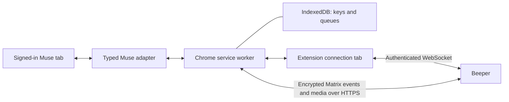

# Beeper Muse

[](https://github.com/nishu-builder/beeper-muse/actions/workflows/ci.yml?query=branch%3Amain)
[](https://chromewebstore.google.com/detail/beeper-muse/bchjpmhhlhpcokhlmbpbiibehfjdgnme)
[](https://github.com/nishu-builder/beeper-muse/releases/latest)
[](LICENSE)

Use your Muse conversation from a dedicated chat in Beeper. Runs entirely in
Chrome, with no companion app or background terminal.

[Website](https://nishu-builder.github.io/beeper-muse/) · [Get started](docs/chrome-setup.md) · [Download](https://github.com/nishu-builder/beeper-muse/releases/latest)
· [Architecture](docs/architecture.md) · [Troubleshooting](docs/operations.md)
· [Privacy](PRIVACY.md) · [Parity and known issues](docs/parity.md)

**Experimental community integration.** The Beeper connection uses its
application-service protocol; the Muse connection reads and operates your
signed-in webpage. Changes to either service can interrupt syncing. See the
[validation record](docs/validation.md) for tested behavior and remaining live
checks. This project is unaffiliated with Beeper or Meta.

## Get started

You need Chrome 127+, a Beeper account, and access to [Muse](https://muse.ai/).
One-time registration uses [bbctl](https://github.com/beeper/bridge-manager),
Node.js 24+, and a terminal on macOS or Linux. No Go compiler or local server
is needed for the Chrome extension.

1. Install from the [Chrome Web Store](https://chromewebstore.google.com/detail/beeper-muse/bchjpmhhlhpcokhlmbpbiibehfjdgnme), download a [GitHub release](https://github.com/nishu-builder/beeper-muse/releases/latest), or [build from source](docs/chrome-setup.md#build-from-source).
2. Create a Beeper registration and import its private JSON file in the popup.
3. Open Muse, wait for **Beeper: Connected**, and click **Connect this Muse tab**.
4. Send a message in the **Muse** chat in Beeper.

Follow the [setup guide](docs/chrome-setup.md) for the exact commands and download
instructions. The Web Store can lag behind GitHub while Google reviews a release;
check the installed version before following an older store listing.

Keep the Muse tab and the small **Beeper Muse connection** tab open. You can pin
the connection tab. Closing Chrome pauses syncing. Your phone can use the Beeper
chat while Chrome stays running on your computer.

For local development updates, `npm run update:local` rebuilds and installs the
current checkout. Once the update hook is installed, the extension waits for
active work, reloads and reconnects Muse automatically. See the
[one-time setup](docs/chrome-setup.md#update-without-losing-state). Store installs
use Chrome's update service. Maintainers can use the
[repeatable development loop](docs/development-loop.md) to check the installed
build and run synthetic messages through the actual integration without copying
errors or resending tests manually.

## What syncs

| Direction      | Supported                                                                                 |
| -------------- | ----------------------------------------------------------------------------------------- |
| Beeper to Muse | Text prompts; photo uploads in preview (see below)                                        |
| Muse to Beeper | User and assistant messages with native sender identities                                 |
| Rich content   | Headings, tables, lists, code, links, accessible encrypted images, and edits              |
| Activity       | Observed Muse reactions; typing translation implemented, live display under investigation |
| Catch-up       | Latest 20 loaded messages, all loaded messages, or only new messages                      |

History is sent with notification suppression and marked read. Repeat scans use
saved source IDs to avoid duplicate imports. Source timestamps are preserved when
Muse exposes them; otherwise the first observation time is used. Catch-up does
not retrieve the entire account history or reorder older messages already in
Beeper. Operating-system notification behavior still needs broader live testing.

Interactive cards, approvals, shopping controls, and embedded browsers stay in
Muse. Beeper-to-Muse edits, reactions, typing, video, and general files are not supported.
Muse read receipts are not inferred from acknowledgments or reaction icons.
Images blocked by browser access rules remain links when possible. Keep the Muse message box
empty while the bridge is handling a prompt.

The extension can copy the selected assistant's recognizable avatar to the
Beeper chat. This is implemented but not yet verified against the live Babar
header. Ambiguous or inaccessible pictures leave the existing avatar unchanged.

Beeper may identify this custom account as a generic self-hosted `bridgev2`
account rather than a named Muse network. A dedicated chat and a connected
registration do not guarantee a separate branded entry in every client. The
[parity ledger](docs/parity.md) tracks the Account display investigation and
distinguishes implementation from verification in Desktop and mobile.

## Photos

Muse images can appear as native encrypted images in Beeper, including local
previews and images selected through responsive loading. Retrieval is limited to
PNG, JPEG, GIF and WebP. Images that fit the 2 MB per-image and 4 MB per-message
transfer limits keep their original bytes. Larger still PNG/JPEG images (up to
20 MB downloaded) are compressed to WebP, at most 2048 pixels on the longest side.
Oversized animations are not flattened. Inaccessible HTTP images remain links;
inaccessible local previews show an explanation. Muse can defer rendering images
in background tabs; those images can only sync once Muse exposes them in the page.

**Beeper-to-Muse photo uploads are a preview.** Send one PNG, JPEG, GIF or WebP
photo up to 5 MB in the dedicated Beeper chat, optionally with a caption. The
worker downloads and decrypts it, then the adapter attempts to attach it to
Muse's message form. It requires an unambiguous image input, a loaded preview
and an enabled Send button. Failed or interrupted uploads appear in the popup;
check Muse before dismissing the job and sending the photo again.

The media API round trip and synthetic upload tests pass. Uploading through the
current Muse website has **not** been verified: browser inspection was unavailable.
See [image validation](docs/validation.md#image-support-acceptance). The new storage
permission may require accepting an extension update in Chrome.

If sending stalls, the popup identifies the interrupted job. Inspect Muse and
choose **Dismiss this job** to skip it and release later sends. For troubleshooting,
use **Diagnostic log** to choose a file that updates automatically without
including your conversations. See [logging and recovery](docs/operations.md#save-a-diagnostic-log).

## How it works



The worker owns encryption, message translation, and durable queues. The
connection tab holds Beeper's WebSocket; it does not display your messages.
The Muse content script receives only the work for your selected conversation,
not Beeper credentials. No localhost service, native messaging host, or Beeper
Desktop API is used during normal operation.

The [typed adapter contract](src/muse.d.ts) separates website observation from
sync and Matrix delivery. A future official Muse API can replace the DOM adapter
without replacing the transport or encryption layers. See
[architecture](docs/architecture.md) and [runtime details](docs/browser-runtime.md).

## Build and contribute

```sh
git clone https://github.com/nishu-builder/beeper-muse.git
cd beeper-muse
npm ci --ignore-scripts
npm run build
npm run package
```

`dist/chrome-extension/` is the public unpacked build.
`dist/beeper-muse-extension.zip` and `dist/SHA256SUMS` are the release artifacts.
Never distribute `.local/`: it can contain powerful account credentials.

For the full test suite, also install Go 1.26+ and a C compiler, then run
`npm run check`. CI checks Linux and macOS. See [contributing](CONTRIBUTING.md),
[releasing](docs/RELEASING.md), [security](SECURITY.md), and
[third-party notices](NOTICES.md). Original project code is MIT licensed.

The older Go companion remains in source for reference and existing installs.
It is not included in the current extension package. Its instructions are in
[the legacy guide](docs/legacy-companion.md).
