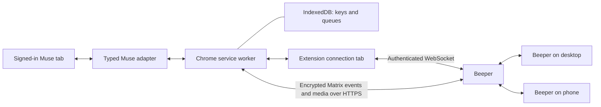

# Beeper Muse

[](https://github.com/nishu-builder/beeper-muse/actions/workflows/ci.yml?query=branch%3Amain)
[](https://chromewebstore.google.com/detail/beeper-muse/bchjpmhhlhpcokhlmbpbiibehfjdgnme)
[](https://github.com/nishu-builder/beeper-muse/releases/latest)
[](LICENSE)

Your Muse conversation, alongside your other chats in Beeper. Connected directly
from Chrome on one of your devices; **the bridge is fully local**.

[Website](https://nishu-builder.github.io/beeper-muse/) · [Chrome Web Store](https://chromewebstore.google.com/detail/beeper-muse/bchjpmhhlhpcokhlmbpbiibehfjdgnme) · [Setup](docs/chrome-setup.md) · [Source releases](https://github.com/nishu-builder/beeper-muse/releases/latest) · [Documentation](docs/README.md)

## Get started

You need Chrome 127+, a Beeper account, and access to [Muse](https://muse.ai/).
Registration is a one-time terminal step using Node.js 24+ and
[bbctl](https://github.com/beeper/bridge-manager) on macOS or Linux.

1. Install from the Chrome Web Store, a GitHub release, or [build from source](docs/chrome-setup.md#build-from-source).
2. Follow the [setup guide](docs/chrome-setup.md) to create and import your private Beeper registration.
3. Open Muse and click **Connect this Muse tab** once Beeper is connected.
4. Open the **Muse** chat in Beeper and send a message.

Keep the Muse tab and **Beeper Muse connection** tab open on your computer.
Beeper works on your phone while Chrome stays running. No server, companion app
or terminal remains running. Store releases may lag behind GitHub during review.

## What works

| Feature    | Support                                                                 |
| ---------- | ----------------------------------------------------------------------- |
| Messages   | Text both ways, native user/assistant identities, edits from Muse       |
| Formatting | Headings, tables, lists, code and links                                 |
| Photos     | Both directions, in preview; limits below                               |
| Activity   | Observed Muse reactions; typing appearance/clearing verified in Desktop |
| Avatar     | Selected assistant's picture; Babar verified in Desktop                 |
| Catch-up   | Latest 20 loaded messages, all loaded messages, or only new messages    |

Catch-up uses quiet batches and read markers. Repeated scans are deduplicated.
Muse does not always expose original timestamps; those messages use their first
observation time. Older imports do not move between existing Beeper messages.
Native unread behavior passed in Desktop; mobile notifications and OS banners
need broader testing.

Approvals, interactive cards and embedded browsers stay in Muse. Sending edits,
reactions or typing from Beeper to Muse, general files, video and side-chat
routing are not supported. Muse read receipts are not inferred from reaction icons.
Beeper may display the account as a generic self-hosted bridge.

This is an experimental integration with a website that can change.
[Known issues](docs/parity.md) and [validation](docs/validation.md) distinguish
implemented features from installed-app evidence.

## Photos

Muse images can appear as native encrypted images in Beeper, including local
previews and images selected through responsive loading. Retrieval is limited to
PNG, JPEG, GIF and WebP. Images that fit the 2 MB per-image and 4 MB per-message
transfer limits keep their original bytes. Larger still PNG/JPEG images (up to
20 MB downloaded) are compressed to WebP, at most 2048 pixels on the longest side.
Oversized animations are not flattened. Inaccessible HTTP images remain links;
inaccessible local previews show an explanation. Muse can defer rendering images
in background tabs; those images can only sync once Muse exposes them in the page.

**Beeper-to-Muse photo uploads are a preview.** Send one PNG, JPEG, GIF or WebP
photo up to 5 MB in the dedicated Beeper chat, optionally with a caption. The
worker downloads and decrypts it, then the adapter attempts to attach it to
Muse's message form. It requires an unambiguous image input, a loaded preview
and an enabled Send button. Failed or interrupted uploads appear in the popup;
check Muse before dismissing the job and sending the photo again.

An installed synthetic PNG upload and a subsequent text message passed with
native delivery confirmation. Other formats, sizes and multiple-image uploads
need broader testing. See [image validation](docs/validation.md#image-support-acceptance).

If sending stalls, the popup identifies the interrupted job. Inspect Muse and
choose **Dismiss this job** to skip it and release later sends. For troubleshooting,
use **Diagnostic log** to choose a file that updates automatically without
including your conversations. See [logging and recovery](docs/operations.md#save-a-diagnostic-log).

## How it works



The worker owns encryption, message translation and durable queues. The content
script operates only the selected Muse conversation and never receives Beeper
credentials. The connection tab holds the WebSocket. Messages travel through
Muse and Beeper's services; this project runs no relay server.

The [typed adapter](src/muse.d.ts) separates Muse's webpage from sync and delivery,
so a future official API can replace DOM access. See [architecture](docs/architecture.md),
[privacy](PRIVACY.md) and [security](SECURITY.md). This project is unaffiliated with
Beeper or Meta.

## Development

Use Node.js 24+ and npm. Package tests also use unzip, included on macOS and most
Linux development systems.

```sh
git clone https://github.com/nishu-builder/beeper-muse.git
cd beeper-muse
npm ci --ignore-scripts
npm run check
npm run package
```

Load `dist/chrome-extension/` for the public unpacked build. Release artifacts
are `dist/beeper-muse-extension.zip` and `dist/SHA256SUMS`.
Never distribute `.local/`: it can contain account credentials.

`npm run update:local` updates an existing local installation and reloads when
idle; see the [one-time setup](docs/chrome-setup.md#update-without-losing-state).
The optional [development loop](docs/development-loop.md) verifies installed
builds and journals live tests without replaying uncertain messages.

See [contributing](CONTRIBUTING.md), [releasing](docs/RELEASING.md) and
[third-party notices](NOTICES.md). Original project code is MIT licensed.
