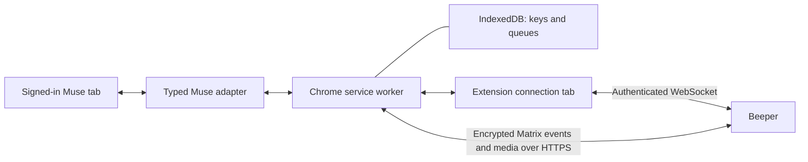

# Beeper Muse

Use your Muse conversation from a dedicated chat in Beeper. Runs entirely in
Chrome, with no companion app or background terminal.

[Get started](docs/chrome-setup.md) · [Download](https://github.com/nishu-builder/beeper-muse/releases/latest)
· [Architecture](docs/architecture.md) · [Troubleshooting](docs/operations.md)
· [Privacy](PRIVACY.md)

**Experimental community integration.** The Beeper connection uses its
application-service protocol; the Muse connection reads and operates your
signed-in webpage. Changes to either service can interrupt syncing. See the
[validation record](docs/validation.md) for tested behavior and remaining live
checks. This project is unaffiliated with Beeper or Meta.

## Get started

You need Chrome 127+, a Beeper account, and access to [Muse](https://muse.ai/).
One-time registration uses [bbctl](https://github.com/beeper/bridge-manager),
Node.js 24+, and a terminal on macOS or Linux. No Go compiler or local server
is needed for the Chrome extension.

1. Install the extension from the latest GitHub release, or build it from source.
2. Create a Beeper registration and import its private JSON file in the popup.
3. Open Muse, wait for **Beeper: Connected**, and click **Connect this Muse tab**.
4. Send a message in the **Muse** chat in Beeper.

Follow the [setup guide](docs/chrome-setup.md) for the exact commands and download
instructions. The Web Store can lag behind GitHub while Google reviews a release;
check the installed version before following an older store listing.

Keep the Muse tab and the small **Beeper Muse connection** tab open. You can pin
the connection tab. Closing Chrome pauses syncing. Your phone can use the Beeper
chat while Chrome stays running on your computer.

For local development updates, `npm run update:local` rebuilds and installs the
current checkout. Once the update hook is installed, the extension waits for
active work, reloads and reconnects Muse automatically. See the
[one-time setup](docs/chrome-setup.md#update-without-losing-state). Store installs
use Chrome's update service.

## What syncs

| Direction      | Supported                                                            |
| -------------- | -------------------------------------------------------------------- |
| Beeper to Muse | New text prompts from you in the dedicated chat                      |
| Muse to Beeper | User and assistant messages with native sender identities            |
| Rich content   | Allowed formatting, links, accessible encrypted images, and edits    |
| Activity       | Observed Muse reactions and a typing indicator while Muse works      |
| Catch-up       | Latest 20 loaded messages, all loaded messages, or only new messages |

History is sent with notification suppression and marked read. Repeat scans use
saved source IDs to avoid duplicate imports. Source timestamps are preserved when
Muse exposes them; otherwise the first observation time is used. Catch-up does
not retrieve the entire account history or reorder older messages already in
Beeper. Operating-system notification behavior still needs broader live testing.

Interactive cards, approvals, shopping controls, and embedded browsers stay in
Muse. Beeper-to-Muse attachments, edits, reactions, and typing are not supported.
Muse read receipts are not inferred from acknowledgments or reaction icons.
Images blocked by browser access rules remain links. Keep the Muse message box
empty while the bridge is handling a prompt.

## How it works



The worker owns encryption, message translation, and durable queues. The
connection tab holds Beeper's WebSocket; it does not display your messages.
The Muse content script receives only the work for your selected conversation,
not Beeper credentials. No localhost service, native messaging host, or Beeper
Desktop API is used during normal operation.

The [typed adapter contract](src/muse.d.ts) separates website observation from
sync and Matrix delivery. A future official Muse API can replace the DOM adapter
without replacing the transport or encryption layers. See
[architecture](docs/architecture.md) and [runtime details](docs/browser-runtime.md).

## Build and contribute

```sh
git clone https://github.com/nishu-builder/beeper-muse.git
cd beeper-muse
npm ci --ignore-scripts
npm run build
npm run package
```

`dist/chrome-extension/` is the public unpacked build.
`dist/beeper-muse-extension.zip` and `dist/SHA256SUMS` are the release artifacts.
Never distribute `.local/`: it can contain powerful account credentials.

For the full test suite, also install Go 1.26+ and a C compiler, then run
`npm run check`. CI checks Linux and macOS. See [contributing](CONTRIBUTING.md),
[releasing](docs/RELEASING.md), [security](SECURITY.md), and
[third-party notices](NOTICES.md). Original project code is MIT licensed.

The older Go companion remains in source for reference and existing installs.
It is not included in the current extension package. Its instructions are in
[the legacy guide](docs/legacy-companion.md).
