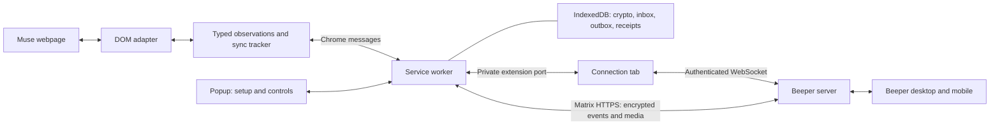

# Architecture

Beeper Muse runs in one Chrome extension, using a signed-in Muse tab, a service
worker, and a small extension connection tab. Beeper's servers route encrypted
Matrix events. No local daemon, filesystem IPC, native messaging host, or
Beeper Desktop API is involved in normal operation.

## Components and ownership

| Component                   | Responsibility                                                        | Source                                                                      |
| --------------------------- | --------------------------------------------------------------------- | --------------------------------------------------------------------------- |
| Muse adapter                | Read the selected conversation and use its composer                   | `src/adapter.ts`                                                            |
| Source contract and tracker | Typed messages, attribution, settling, catch-up and deduplication     | `src/muse.d.ts`, `src/sync.ts`, `src/activity.ts`                           |
| Content script              | Run the adapter for the selected top-level tab                        | `extension/content.js`                                                      |
| Service worker              | Validate senders, run one bridge, coordinate lifecycle and UI         | `browser-runtime/runtime/background.ts`                                     |
| Matrix translator           | Native senders, formatting, images, revisions and delivery            | `browser-runtime/runtime/bridge.ts`                                         |
| Crypto and storage          | Device keys, encrypted sessions, durable records                      | `browser-runtime/runtime/crypto.ts`, `state.ts`, `browser-runtime/inbox.ts` |
| Connection tab              | WebSocket handshake, heartbeats and frame forwarding                  | `connection.ts`, `document-socket.ts`, `socket.ts` in the runtime directory |
| Provisioning                | Answer Desktop's read-only bridge discovery requests                  | `browser-runtime/runtime/provisioning.ts`                                   |
| Popup                       | Import a registration, connect Muse, rescan, pause and inspect errors | `browser-runtime/runtime/popup.ts`                                          |

The worker is the single crypto and delivery owner. It authenticates the
connection document by extension ID, exact URL, top-level frame, tab ID and port
name. The connection document holds the socket credential in memory and forwards
frames; it only sends transaction acknowledgments supplied by the worker after
persistence. The content script never receives Beeper credentials or a selectable
Matrix destination. It is restricted to the connected Muse tab.

## Message flow

For Beeper-to-Muse text, the server delivers an application-service transaction.
The worker saves it before acknowledging, processes crypto updates, decrypts room
events, checks the owner and room membership, and queues an eligible prompt.
The content script claims one prompt, refuses to overwrite a draft, submits
through the visible composer, and binds the response to the observed prompt echo.
A claimed prompt interrupted by a restart becomes blocked for inspection.

Muse observations carry stable source IDs, roles, content, and optional source
times, images and reactions. The worker validates observations, translates them,
encrypts messages/media, and saves the exact outbound batch before sending it.
A lost response retries the same event IDs and ciphertext. Completed payloads are
cleared while compact source receipts remain. No exactly-once guarantee spans
Chrome, Muse, and Beeper.

## Native Matrix mapping

| Source information                      | Representation                                                    |
| --------------------------------------- | ----------------------------------------------------------------- |
| User / assistant role                   | Owner Matrix identity / Muse bridge identity                      |
| Text and allowed formatting             | `m.text`, plain-text fallback, sanitized `org.matrix.custom.html` |
| Accessible image                        | Encrypted media upload and `m.image`                              |
| Changed content with the same source ID | `m.replace` edit; removed image parts are redacted                |
| Observed reaction / removal             | `m.reaction` annotation / redaction                               |
| Muse working / idle                     | Expiring typing notification / typing cleared                     |
| Historical message                      | Notification-suppressed batch with read state                     |
| Absolute source time                    | Original Unix milliseconds                                        |
| Missing source time                     | First-observed time, marked in `com.beeper.muse.timestamp_source` |

Transport acknowledgments confirm durable intake. The bridge marks a completed
Beeper prompt read after handling it; that is separate from an authoritative
Muse read receipt. The DOM adapter does not invent read state from acknowledgments,
checkmarks, tab focus, or reaction icons.

Catch-up covers loaded messages only and does not reposition older events among
messages already in Beeper. Virtualized text-only observations are marked
`partial`: they can fill missing history but cannot downgrade a known rich
message. A rendered observation can upgrade a partial one.

## Replaceable Muse integration

`Muse.Adapter` exposes `snapshot()`, `submit()`, `prepare()`, and `capabilities`.
The contract contains source IDs and data, not DOM nodes, Matrix identifiers,
credentials, or database handles. `snapshot()` may be asynchronous, so a future
API adapter can supply observations without forcing synchronous network access.

A future official API implementation would own its authentication, pagination,
streaming and stable IDs behind this boundary. It would preserve the message and
activity contracts, then feed the existing tracker and Matrix translator. Actual
API semantics must be validated when such an API exists; no speculative Muse
endpoints or cookie extraction are included.

Types are not a security boundary. Validate data crossing Chrome messages,
WebSocket frames and persisted records. Selector changes belong in the adapter;
Matrix event behavior belongs in the translator.

## Website limits

The adapter reads loaded DOM and accessibility text. It excludes toolbars and
reaction controls from message text, uses allowlisted formatting, and obtains
accessible image bytes through ordinary browser fetches with CORS and bounded
size/time limits. It does not bypass browser restrictions. Interactive approvals
and tools stay in Muse.

Response settling and the visible Stop control are heuristics. Delayed responses,
website changes, virtualized content, and interleaved manual messages can delay
or prevent capture. Typing means Muse is visibly working; it does not transmit
your draft. Rich-content fidelity is bounded by what the webpage exposes.

See [runtime protocol details](browser-runtime.md), [security](../SECURITY.md),
[privacy](../PRIVACY.md), and [validation](validation.md).
