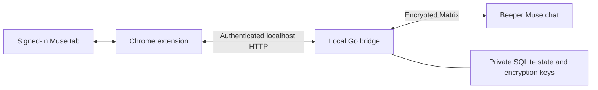

# Architecture

There are three runtime components. They communicate over network connections,
not files:

The Go bridge is currently a process started with `npm start -- start`, which
invokes `bin/beeper-muse`. No login-start service is installed by setup. It must
stay running. The Node command is a setup/launch wrapper; it is not a message
relay. The running bridge does not use the Beeper Desktop API.

## Source boundary

`src/muse.d.ts` defines the strict TypeScript adapter contract. `src/adapter.ts`
contains the browser implementation; `src/sync.ts` contains source-independent
settling, prompt attribution, catch-up, and deduplication. JavaScript is generated
into `extension/` by `npm run build:extension`. `internal/muse` defines and validates
the same source-neutral messages in Go. No browser selectors, Matrix room IDs,
Matrix tokens, or database handles belong in that contract.

A source message carries a stable ID, sender role, text, optional HTML and images,
optional absolute source timestamp, first observation time, history flag, and
optional authoritative reactions/read state. Unknown reactions are distinct from
an explicitly empty reaction list. Read state is not inferred from acknowledgment
text, a checkmark, a visible tab, or an assistant saying it is working.

A future official API adapter would implement `Muse.Adapter`: `snapshot`,
`submit`, `prepare`, and capability reporting. It supplies the same observations;
the tracker and Matrix translator remain unchanged. API streaming/pagination
can be added behind that boundary. Authentication and actual API behavior must
be implemented against the eventual official API; no speculative endpoints are
included here.

## Browser implementation and limits

The adapter reads only the connected conversation's DOM and operates the visible
composer. It strips buttons, toolbars, reaction containers, and status controls
from text. Formatting is rebuilt from an allowlist again on the Go side. Static
image-bearing cards can become formatted text plus images; interactive tools,
approval forms, and embedded browsers remain in Muse.

Images use ordinary page-origin fetches with CORS, no redirect following, an
8-second timeout, a 2 MiB per-image limit, and 4 MiB per message. No extra Chrome
host permissions or CORS bypass are used. PNG/JPEG/GIF/WebP bytes go through
mautrix's encrypted media upload. Unavailable images become links. Outgoing
Beeper messages still support text only.

The DOM adapter can read absolute `time[datetime]` timestamps. It does not parse
relative times or invent a date/time zone. Without a source timestamp, it uses
the first observation time, retained across queue delay and restart. Events label
that provenance in `com.beeper.muse.timestamp_source`. This is an approximation,
not a claim to have recovered the historical send time.

The first history selection waits for the loaded message IDs to settle. Completed
messages can sync while Muse is busy; only its trailing assistant message waits
for the task to finish. Older messages inserted before known DOM messages remain
historical. An empty log during page load does not consume the initial selection.
The popup reports loaded/selected/checked counts independently from delivery queue
state. **Catch up now** scans the selected loaded history again; durable source
receipts suppress duplicates. It does not fetch a hidden archive or move already
posted Matrix events. Scroll in Muse to load older messages before rescanning.

The source contract and Matrix translator support reaction snapshots and owner
read receipts. **The DOM adapter currently reports these capabilities as absent:**
we have not verified markup exposing the reaction actor or authoritative read
state. It does not synthesize receipts from acknowledgments.

## Transient activity

`Muse.Activity` reports `idle` or `working` independently of stored messages.
The DOM adapter derives this from Muse's visible Stop control. The content script
uses a separate heartbeat during message capture and catch-up. It renews at most
once per five seconds and clears on idle, page exit, and disconnect. No draft
text, source message, read state, or catch-up record is sent with activity.

`MuseBridge.Transport.activity` forwards the state through authenticated
`POST /v1/activity`; the Go connector fixes the destination and Muse sender and
uses mautrix's `MarkTyping` with a 12-second timeout (zero to stop). Publishing
working state requires the normal private membership checks. There is no durable
activity queue: restart cannot replay stale typing. The service worker serializes
activity and disconnect cleanup. The native bridge also throttles renewals.
Status advertises `activitySync` so older companions do not break message capture.

This is incoming Muse activity only; the room does not advertise outgoing typing
or reaction support that the source adapter cannot provide.

## Native Matrix mapping

`internal/connector/delivery.go` is the Matrix translator. It uses mautrix
bridgev2's sender intents, media encryption, `BatchSend`, and message/reaction
mapping database. Muse remains the other participant in the private DM.

| Muse information                | Beeper / Matrix representation                                           |
| ------------------------------- | ------------------------------------------------------------------------ |
| User role                       | `IsFromMe` and the owner's configured double-puppet intent               |
| Assistant role                  | Muse ghost                                                               |
| Text / formatting               | `m.text` with sanitized `org.matrix.custom.html` and plain-text fallback |
| Accessible image                | `m.image`, using the framework's encrypted upload result                 |
| Same source ID, changed content | `m.replace` edits; removed parts are redacted                            |
| Explicit reaction actor/key     | `m.reaction`; removed reactions are redacted                             |
| Explicit owner read state       | Native read marker, never a text message                                 |
| Catch-up                        | Forward batch, `send_notification=false`, `mark_read_by=owner`           |
| Source timestamp                | Original Unix milliseconds, when known                                   |

Catch-up is treated as already read. Only new unread assistant messages request
notifications. Forward batches preserve the imported order. This is catch-up of
the selected loaded messages, not arbitrary insertion of all historical events
into their original positions among already-existing Matrix events.

Self-sending requires the double-puppet session provisioned by Beeper registration.
If unavailable, delivery stops instead of silently replacing the owner with a
second ghost. See the [mautrix explanation](https://docs.mau.fi/bridges/general/double-puppeting.html).
Existing encrypted transport and key handling stay in mautrix.

## Queue and recovery

The owner, portal, message type, and room membership are checked before accepting
Beeper prompts. The browser cannot choose a destination. The local HTTP server
requires the fixed loopback Host and private bearer token and bounds/validates
all JSON, text, HTML, timestamps, reaction data, and media.

SQLite persists source revisions and queued payloads in one transaction. Stable
remote IDs identify a message independently of content revisions. A monotonic
revision counter permits edits that restore previous text and reactions that
are removed then re-added. Version 0.4 receipts suppress duplicate imports of
unchanged legacy text. Already imported legacy senders/timestamps are not rewritten.

A structured prompt result atomically maps its Muse user echo to the existing
Beeper message and queues individual assistant replies with native reply
relations. It does not send the echo as another owner message or collapse all
replies into a new aggregate message.

Jobs enter `delivering` before Matrix sends. Completion requires persisted Matrix
mappings; completed text, HTML, and image bytes are cleared. Source IDs, hashes,
revision counters, and remote mappings remain. Ambiguous sends or interrupted
claims are blocked, never blindly resubmitted to Muse. See [operations](operations.md)
before acknowledging a blocked job. SQLite WAL files and backups can retain old
content even after active rows are cleared.

`internal/matrixfix` retains the existing startup-order workaround for pinned
mautrix v0.30.0: crypto listeners are registered before queued websocket events
can arrive. It preserves the framework's cryptography and trust checks.

## Could everything run in Chrome?

A browser implementation could use IndexedDB for persistence and a JavaScript or
WebAssembly Matrix client. Disk access to Beeper is not the obstacle. However,
that requires replacing this Go bridge's appservice transport, registration,
encryption, recovery, and lifecycle handling. Chrome can terminate an idle
extension service worker; active WebSocket traffic can extend its lifetime, but
termination and browser shutdown still need recovery. See [Chrome's lifecycle
documentation](https://developer.chrome.com/docs/extensions/develop/concepts/service-workers/lifecycle).

The target is an extension-only runtime. `src/bridge.ts` now defines the typed
`MuseBridge.Transport` boundary and the existing `LocalBridge` implementation.
The service worker uses `status`, `importMessages`, `claim`, `complete`, and
`block`; the source adapter has no dependency on localhost or native storage.
A browser implementation can replace that transport without rewriting DOM
capture or a future Muse API adapter. The current release still uses the Go
companion; changing the interface alone does not replace it.

See [the browser runtime design](browser-runtime.md) for the implementation and
migration requirements. No browser Matrix credentials, new host permissions, or
experimental crypto are included in the shipped extension yet.
