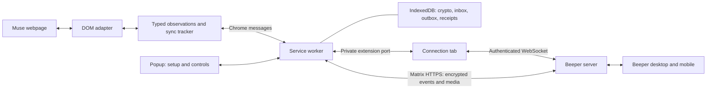

# Architecture

Beeper Muse runs in one Chrome extension, using a signed-in Muse tab, a service
worker, and a small extension connection tab. Beeper's servers route encrypted
Matrix events. No local daemon, filesystem IPC, native messaging host, or
Beeper Desktop API is involved in normal operation.

## Components and ownership

| Component                   | Responsibility                                                        | Source                                                                      |
| --------------------------- | --------------------------------------------------------------------- | --------------------------------------------------------------------------- |
| Muse adapter                | Read the selected conversation and use its composer                   | `src/adapter.ts`                                                            |
| Source contract and tracker | Typed messages, attribution, settling, catch-up and deduplication     | `src/muse.d.ts`, `src/sync.ts`, `src/activity.ts`                           |
| Content script              | Run the adapter for the selected top-level tab                        | `extension/content.js`                                                      |
| Service worker              | Validate senders, run one bridge, coordinate lifecycle and UI         | `browser-runtime/runtime/background.ts`                                     |
| Matrix translator           | Native senders, formatting, images, revisions and delivery            | `browser-runtime/runtime/bridge.ts`                                         |
| Crypto and storage          | Device keys, encrypted sessions, durable records                      | `browser-runtime/runtime/crypto.ts`, `state.ts`, `browser-runtime/inbox.ts` |
| Connection tab              | WebSocket handshake, heartbeats and frame forwarding                  | `connection.ts`, `document-socket.ts`, `socket.ts` in the runtime directory |
| Provisioning                | Answer Desktop's read-only bridge discovery requests                  | `browser-runtime/runtime/provisioning.ts`                                   |
| Popup                       | Import a registration, connect Muse, rescan, pause and inspect errors | `browser-runtime/runtime/popup.ts`                                          |

The worker is the single crypto and delivery owner. It authenticates the
connection document by extension ID, exact URL, top-level frame, tab ID and port
name. The connection document holds the socket credential in memory and forwards
frames; it only sends transaction acknowledgments supplied by the worker after
persistence. The content script never receives Beeper credentials or a selectable
Matrix destination. It is restricted to the connected Muse tab.

## Message flow

For Beeper-to-Muse text, the server delivers an application-service transaction.
The worker saves it before acknowledging, processes crypto updates, decrypts room
events, checks the owner and room membership, and queues an eligible prompt.
The content script claims one prompt, refuses to overwrite a draft, submits
through the visible composer, and binds the response to the observed prompt echo.
A claimed prompt interrupted by a restart becomes blocked for inspection.

Muse observations carry stable source IDs, roles, content, and optional source
times, images and reactions. The worker validates observations, translates them,
encrypts messages/media, and saves the exact outbound batch before sending it.
A lost response retries the same event IDs and ciphertext. Completed payloads are
cleared while compact source receipts remain. No exactly-once guarantee spans
Chrome, Muse, and Beeper.

## Native Matrix mapping

| Source information                      | Representation                                                    |
| --------------------------------------- | ----------------------------------------------------------------- |
| User / assistant role                   | Owner Matrix identity / Muse bridge identity                      |
| Text and allowed formatting             | `m.text`, plain-text fallback, sanitized `org.matrix.custom.html` |
| Accessible image                        | Encrypted media upload and `m.image`                              |
| Changed content with the same source ID | `m.replace` edit; removed image parts are redacted                |
| Observed reaction / removal             | `m.reaction` annotation / redaction                               |
| Muse working / idle                     | Expiring typing notification / typing cleared                     |
| Historical message                      | Notification-suppressed batch with read state                     |
| Absolute source time                    | Original Unix milliseconds                                        |
| Missing source time                     | First-observed time, marked in `com.beeper.muse.timestamp_source` |

Transport acknowledgments confirm durable intake. The bridge marks a completed
Beeper prompt read after handling it; that is separate from an authoritative
Muse read receipt. The DOM adapter does not invent read state from acknowledgments,
checkmarks, tab focus, or reaction icons.

Typing uses a lightweight activity observation, independent of transcript reads
and composer availability. Every four seconds the connected worker asks the
selected Muse tab for a fresh observation, so renewal does not rely on the page's
background timers. The source recognizes visible Stop/Stop generating controls
outside the transcript and explicit busy state scoped to the composer or named
assistant header. Historical tool cards and whole-page loading are excluded. Working
state renews at most once every five seconds with a twelve-second Matrix expiry;
idle clears it. The worker does not replay cached activity when the source tab
stops responding. Chrome suspension and page freezing can still interrupt updates.

Source-readiness counts and accepted/failed typing requests are recorded separately
in the optional diagnostic log. An accepted request is not proof that either
client rendered an indicator. `com.beeper.room_features` is not yet advertised;
its effect on this custom bridge's client controls remains under investigation.

## Assistant profile

The optional typed adapter `profile()` supplies avatar bytes independently of
message snapshots. The DOM implementation requires one visible image matching the
assistant named in the chat title, outside navigation and transcript content.
An absent or ambiguous match does not erase an existing avatar. Reads are bounded,
cached briefly, and cannot block the message queue.

`AvatarSync` validates image type, signature and size, verifies room membership,
uploads ordinary Matrix avatar media, and updates the bot profile, joined member,
room avatar, and channel avatar in both bridge-info state events. Other state
fields are preserved. A durable hash/media record avoids uploading the same
picture on each scan or retrying an upload after a partial metadata failure.
These profile/state images are not encrypted message attachments. No image data,
assistant name or media address is added to diagnostics.

Catch-up covers loaded messages only and does not reposition older events among
messages already in Beeper. Virtualized text-only observations are marked
`partial`: they can fill missing history but cannot downgrade a known rich
message. A rendered observation can upgrade a partial one.

## Replaceable Muse integration

`Muse.Adapter` exposes `snapshot()`, `submit()`, `prepare()`, optional `activity()`,
and `capabilities`.
The contract contains source IDs and data, not DOM nodes, Matrix identifiers,
credentials, or database handles. `submitImage(prompt, upload, wait, active)` is an optional typed operation for
photo submissions. `Upload` contains only a filename, MIME type and base64 bytes;
it contains no Matrix credentials or encryption metadata. `snapshot()` may be asynchronous, so a future
API adapter can supply observations without forcing synchronous network access.

A future official API implementation would own its authentication, pagination,
streaming and stable IDs behind this boundary. It would preserve the message and
activity contracts, then feed the existing tracker and Matrix translator. Actual
API semantics must be validated when such an API exists; no speculative Muse
endpoints or cookie extraction are included.

Types are not a security boundary. Validate data crossing Chrome messages,
WebSocket frames and persisted records. Selector changes belong in the adapter;
Matrix event behavior belongs in the translator.

## Website limits

The adapter reads loaded DOM and accessibility text. It excludes toolbars and
reaction controls from message text, uses allowlisted formatting, and obtains
accessible image bytes through ordinary browser fetches with CORS and bounded
size/time limits. It does not bypass browser restrictions. Interactive approvals
and tools stay in Muse.

Response settling and the visible Stop control are heuristics. Delayed responses,
website changes, virtualized content, and interleaved manual messages can delay
or prevent capture. Typing means Muse is visibly working; it does not transmit
your draft. Rich-content fidelity is bounded by what the webpage exposes.

See [runtime protocol details](browser-runtime.md), [security](../SECURITY.md),
[privacy](../PRIVACY.md), and [validation](validation.md).

## Updates and reconnection

`updates.ts` coordinates both Chrome's `onUpdateAvailable` event and local
completed-build markers. Only an unpacked (`management.getSelf().installType`)
installation reads `dev-update.json`. The worker's compiled source fingerprint
is compared with the marker; public ZIPs omit local build metadata. The build
and copy command exits after a staged folder replacement, with a per-destination
writer lock. It preserves private files and leaves the old installation intact
if staging fails. A failed final rename attempts to restore the previous folder.
An interrupted rename can leave a `.previous-*` backup requiring local recovery;
never delete an update lock without checking that its writer has stopped.

Pending updates prevent new claims. The updater waits for claimed jobs, ongoing
handlers and the content script's current poll/activity to finish. The content
script stops its observers only at a safe boundary; the worker stops the socket
and waits for its durable inbox and serialized delivery work before reloading.
A short-lived local ticket stores only the selected tab ID, Chrome document ID and expiry. After the
new runtime connects, it validates the ticket and main Muse URL and injects its
packaged scripts into that tab's isolated main frame using `scripting`. Restoration targets that exact document ID; navigation or a new browser session
cannot redirect it to another page with a reused tab ID. It does
not refresh or navigate Muse, select another tab, or erase IndexedDB. Old scripts
remove their timers/listeners when their extension context is invalidated.

Chrome may delay store updates while the connection page and worker stay active;
explicit safe reloads apply an already-downloaded update. This mechanism cannot
bypass store review, permission prompts, browser shutdown or frozen pages.

## Images in both directions

For incoming `m.image` events, `media.ts` validates the Matrix address, declared
format and size. `MatrixAPI.downloadImage` uses the authenticated media endpoint;
native fetch follows Beeper's signed storage redirect and strips Authorization
when crossing origins. The extension's network policy permits only itself,
Beeper and HTTPS Cloudflare R2 storage. It sends no browser cookies or referrer.
The stream is capped at 5 MB regardless of Content-Length. Rust/WASM authenticates
and decrypts encrypted attachments; MIME signatures are checked before the
worker passes a source-neutral `Upload` to the selected Muse adapter.

Queued jobs retain the media reference, not downloaded plaintext image bytes.
Claimed jobs are persisted before the adapter runs. The adapter refuses drafts,
ambiguous file inputs, missing previews and changed composers. A failure blocks
the job for user inspection, with no automatic resend. Completion associates
the source echo with the original Beeper image event so later catch-up cannot
replace it with text or send it a second time. Observed reactions still target
that original event. Arbitrary files and interactive approvals stay unsupported.

For outgoing images, the adapter resolves responsive image selection and accepts
ordinary HTTP URLs, same-origin blob previews and bounded embedded raster images.
It uses ordinary page-origin fetches and retains fallback links when bytes are
unavailable. The worker encrypts available bytes as native `m.image` events.
See the [validation limits](validation.md#image-support-acceptance) before treating
the incoming adapter as compatible with the current Muse website.

## Diagnostics and delivery confirmation

`diagnostic-log.ts` validates a closed event vocabulary and field schema at both
collection and export. The worker serializes writes to a 200-entry local ring;
logging failures do not interrupt message handling. Only the socket-lock owner
starts `log-controls.ts`. A user-selected File System Access handle lives in a
separate state scope. `log-file.ts` serializes file writes, skips unchanged
snapshots and aborts failed writes; it does not request permission in background.
The connection heartbeat and a timer flush changes. No remote logging endpoint,
raw DOM dump or arbitrary file-reading facility is added.

Incoming jobs publish `com.beeper.message_send_status` using `m.reference` to the
original event. `PENDING` has an empty `delivered_to_users`; `SUCCESS` names the
Muse bridge actor only after the adapter observes a matching prompt echo and new
reply. Interrupted or skipped unconfirmed jobs report `FAIL_PERMANENT`. A failed
reply export does not reverse already confirmed delivery. Deterministic status
transaction IDs and saved fingerprints allow retries without resending prompts.
Legacy completed jobs are not relabeled. Native status display still needs client
verification; source confirmation is a website observation rather than an API receipt.
