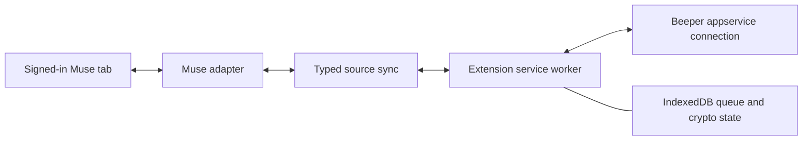

# Browser runtime

Decision: move toward an extension-only bridge. Status: design and typed transport
boundary implemented; direct Beeper transport and crypto migration are not yet
implemented or verified in Chrome. The released runtime still needs the companion.

## Components

The popup manages connection and diagnostics. The service worker owns Beeper
credentials, encrypted transport, and recovery. The content script only sees the
source contract and commands for the selected Muse tab. Neither the popup nor a
content script creates its own Matrix crypto client. Closing Chrome stops the
bridge; opening Chrome must resume from persisted state.

The current bridge communicates over HTTP and WebSocket, not filesystem IPC.
IndexedDB can replace the SQLite queue. Browser encryption is available through
the [Matrix JavaScript SDK's Rust/WASM crypto](https://matrix-org.github.io/matrix-js-sdk/index.html#end-to-end-encryption-support),
which supports persistent IndexedDB storage. That establishes a plausible route,
not compatibility with Beeper's application-service extensions or the existing
Go crypto database.

## Work needed before switching

1. **Registration and transport.** Implement Beeper registration in extension UI,
   then connect directly to its application-service WebSocket. Preserve the Muse
   participant, owner identity, room membership checks, and account isolation.
   Beeper's pinned [WebSocket implementation](https://github.com/mautrix/go/blob/v0.30.0/appservice/websocket.go)
   sends Authorization, process ID, and protocol-version headers. Browser
   WebSocket constructors cannot set those headers. Verify an authenticated
   Chrome handshake before committing to this path. A narrowly scoped extension
   request-header rule is a candidate; never put credentials in a URL or broadly
   attach them to requests. Do not introduce a proxy daemon to solve this step.
2. **Crypto and native events.** Verify appservice transactions, to-device key
   events, double-puppet encryption, encrypted attachments, edits, reactions, and
   Beeper batch send using bundled SDK/WASM code. A normal Matrix chat client is
   not a drop-in replacement for the current appservice bridge. Retain explicit
   timestamp provenance and notification suppression.
3. **Durability.** Persist an incoming transaction before acknowledging it. Store
   message IDs, revision receipts, outgoing work, and crypto state in IndexedDB.
   Keep one crypto owner, including during worker restart. A connection conflict
   must stop, not repeatedly replace the existing bridge. Reuse deterministic
   event IDs and never resend an uncertain Muse prompt automatically.
4. **Lifecycle.** Support reconnect with bounded backoff and alarms. Chrome can
   terminate a worker and users can close the browser. Active WebSocket traffic
   resets the idle timer in supported Chrome versions, but cannot replace crash
   recovery. See [Chrome's lifecycle documentation](https://developer.chrome.com/docs/extensions/develop/concepts/service-workers/lifecycle).
5. **Migration.** Test with an isolated registration first. Export or replace the
   crypto device through supported APIs; copying the Go SQLite database into
   IndexedDB is not a migration. Preserve the existing Muse room, source mappings,
   and queued results. Switch ownership once, keep a private rollback backup, and
   verify both directions with the companion stopped before calling it daemon-free.

## Validation required

A real Chrome session must demonstrate encrypted messages in both directions,
correct owner/assistant identities, silent repeated history sync, image delivery,
and recovery after worker termination and browser restart. Removing the extension
must stop its connection; no native host or background process may be necessary.
The final public ZIP must contain its runtime code and WASM, exclude private
credentials, and request only the permissions the implemented transport needs.

Chronological history repair is a separate problem: the existing forward import
appends missing history. It cannot reposition older messages between existing
Matrix events. A browser rewrite must not claim that IndexedDB or WebSockets fix
that behavior automatically. Confirm Beeper's backfill semantics with an isolated
room before changing the live chat's history strategy.
